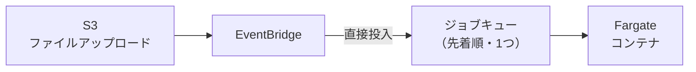
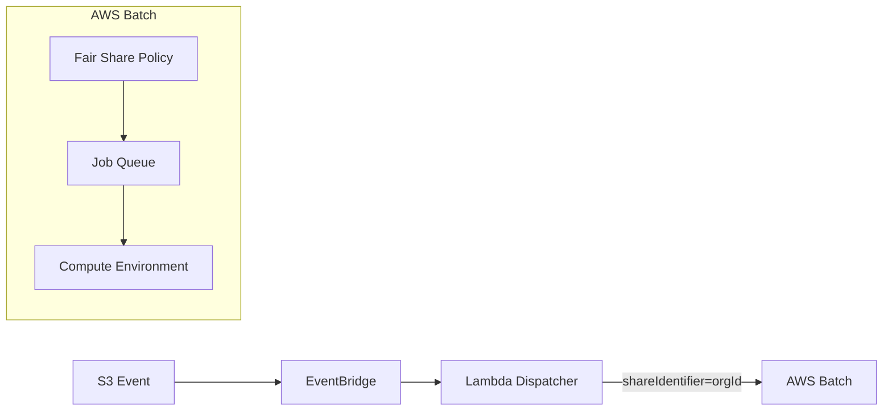

# TL;DR


# はじめに

こんにちは、Dress Code でプロダクトエンジニアをしている [ないとー](https://x.com/_bwkw_) です！

私たちは [DRESS CODE](https://www.dress-code.com/ja) という、人事・情報システム・総務・採用など複数の部門を横断する業務 OS として機能するコンパウンドプロダクトを開発しています。

DRESS CODE では、各組織が CSV などのファイルをアップロードすると、バックエンドのバッチ処理基盤が非同期でデータ変換・取り込み処理を行います。この基盤は AWS Batch on Fargate で動いており、S3 へのファイルアップロードをトリガーに EventBridge 経由でジョブが起動する構成です。

このアーキテクチャ自体はシンプルで問題なく動いていたのですが、マルチテナントの SaaS として複数の組織が同じ基盤を共有している以上、あるリスクが潜んでいました。それが **Noisy Neighbor 問題** です。

この記事では、問題の概要と、AWS Batch の Fair Share Scheduling を使ってそれを軽減した話を紹介します。同じような課題を感じている方の参考になれば幸いです👋

# Noisy Neighbor 問題

## マルチテナント SaaS における典型的なアンチパターン

Noisy Neighbor（騒がしい隣人）問題とは、マルチテナントのシステムにおいて、あるテナントが共有リソースを過剰に消費することで、他テナントのパフォーマンスや体験を低下させる現象です。

AWS Well-Architected Framework の SaaS Lens でも、マルチテナント SaaS アーキテクチャにおける代表的なアンチパターンとして明示的に取り上げられています。CPU・メモリ・ストレージ・DB コネクションといった計算リソースだけでなく、ジョブキューでも同じことは起きます。

https://docs.aws.amazon.com/wellarchitected/latest/saas-lens/noisy-neighbor.html

## 私たちのケース

このバッチ基盤は、ジョブキューが 1 つで、スケジューリングポリシーが未設定でした。つまり、**先に投入されたジョブから順に処理される FIFO 方式**です。

当時の構成は以下のとおりです。



スロットは先着順で埋まるため、大量にジョブを投入した組織がスロットを独占すると、他の組織のジョブはひたすら後ろで待つことになります。

たとえば、組織 A が 100 件・組織 B が 5 件を同時に投入したとします。

```
実行順: A A A A A A A A A A A A ... (100件すべて消化) ... B B B B B
                                                          ^^^^^^^^
                                                          組織 B は組織 A の 100 件が
                                                          完了するまで実行されない
```

組織 B は何も悪いことをしていないのに、組織 A が大量のジョブを投入したというだけで延々と待たされる。これが **Noisy Neighbor 問題** です。

# 解決策の検討

この問題に対して、いくつかの方向性を検討しました。

## 組織ごとにジョブキューを分ける

最初に思い浮かぶのは、組織ごとに専用のジョブキューを用意してリソースを完全に分離する方法です。

ただ、AWS Batch のジョブキューにはアカウント・リージョンあたり 50 という上限があります。
https://docs.aws.amazon.com/ja_jp/batch/latest/userguide/service_limits.html

そのため、組織が増えるたびにキューを追加し、インフラを再デプロイする必要があり、数十組織に達するとすぐに上限に近づいてしまいます。

さらに、各キューは独立したリソースプールを持つため、ある組織のキューがアイドル状態でも、他の組織がそのリソースを利用することはできません。組織数の増加に伴い、このようなリソースの断片化は深刻になり、コスト効率の面でも課題が生じます。

## 大口組織だけ専用キューに分ける

では、大量投入しがちな組織だけを専用キューに分け、残りは共有キューに流すハイブリッドな方法はどうでしょうか。

キューの上限という問題は変わりません。専用キューを追加するたびに上限に近づいていくのは同じです。

さらに、「どの組織が大口か」という分類を誰かが判断し続ける必要があります。組織の規模は時間とともに変わるため、一度決めたら終わりではありません。今日は小口だった組織が、来月には大量投入するようになる可能性は十分あります。この分類をリアルタイムに正確に維持しようとすると、解決したかった問題よりも分類ロジックの方が複雑になってしまいます。

## Fair Share Scheduling Policy を使う

検討した 2 案に共通していたのは、「テナントごとにリソースを物理的に分割する」発想でした。しかし分割にはクォータの上限やリソースの断片化という代償がついて回り、分類ロジックの維持という別の複雑さまで呼び込んでしまいます。

視点を変えて行き着いたのが、**キューを 1 つのまま保ち、その中のスケジューリングを公平化する**アプローチです。AWS Batch の **Fair Share Scheduling Policy** がこれを実現します。

https://aws.amazon.com/blogs/hpc/introducing-fair-share-scheduling-for-aws-batch/

キューが 1 つなのでクォータの問題は生じません。リソースはプールとして共有されるため、ある組織のアイドル分を別の組織が使えてコスト効率も落ちません。そして最大のメリットは、「誰をどれだけ優先するか」の判断をスケジューラー側に委ねられることです。アプリケーション側で組織ごとの使用量を追跡し、ジョブの実行順を制御するようなロジックは不要になります。

# AWS Batch Fair Share の仕組み

Fair Share Scheduling は、先着順ではなく **「最近あまりリソースを使っていない share を優先する」** という発想のスケジューリングポリシーです。`shareIdentifier` ごとに累積リソース使用量を追跡し、使用量の少ない share のジョブを優先して実行します。

`shareIdentifier` には任意の文字列を設定できます。今回はジョブ投入時に `organizationId` を `shareIdentifier` として渡すことで、この仕組みを**組織間の公平なリソース分配**として活用しています。

ただし、この仕組みが期待通りに機能するかはパラメータ設計に依存します。主に設定するのは以下の 3 つです。

## パラメータ設計

今回の環境は `maxvCpus: 10`、`containerCpu: 1` のため、同時実行できるジョブ数は最大 10 です。以下のパラメータはこの 10 並列を前提にした設定値です。

| パラメータ           | 意味                                                                                                                               | 設定値            | 理由                                                                                                                                                                                           |
| -------------------- | ---------------------------------------------------------------------------------------------------------------------------------- | ----------------- | ---------------------------------------------------------------------------------------------------------------------------------------------------------------------------------------------- |
| `shareDecaySeconds`  | 過去の使用量が「忘れられる」までの時間。この期間の累積使用量をもとに次のジョブ優先度を決める                                                                           | 3600 秒（1 時間） | バースト後に 1 時間は優先度を下げたい。データ連携はリアルタイム性不要なのでこのペナルティ期間は許容できる |
| `computeReservation` | 現在アクティブでない（キューにジョブがない状態の）組織のために予約するリソースの割合（%）。予約比率は `(computeReservation / 100) ^ ActiveFairShares` で計算 | 10                | 1 組織が独占しているとき 1 スロット（10%）を他組織用に確保したい。複数組織がアクティブなら予約は指数的に減るのでリソース効率も落ちない |
| `weightFactor`       | 組織ごとの配分の重み。値が小さいほど優先度が高く、より多くのリソースが割り当てられる                                               | 全組織 1.0        | 現時点では全組織同一優先度で十分なため |

`computeReservation` の数式は少し直感的でないので補足します。

- `computeReservation=10`、`ActiveFairShares=1`（1 組織だけ実行中）のとき：予約率 = `0.1^1 = 10%`（= 1 スロット）
- `computeReservation=10`、`ActiveFairShares=2`（2 組織が実行中）のとき：予約率 = `0.1^2 = 1%`（ほぼ 0）

つまり、**「現在キューにジョブがない組織が新たに投入してきたときのために、少しだけスロットを空けておく」** というのが `computeReservation` の役割です。複数の組織がすでにアクティブであれば予約はほぼゼロになり、リソースの無駄が生じません。

# Lambda Dispatcher という設計選択

Fair Share を使うには、ジョブ投入時に `shareIdentifier`（どの組織のジョブか）を指定する必要があります。今回は S3 のキーパスに含まれる `organizationId` を抽出して使います。

最初は EventBridge の Input Transformer で解決できないかと考えました。しかし Input Transformer では**正規表現が使えない**ため、S3 キーパスから動的に値を抽出するのが難しいことがわかりました。また `shareIdentifier` を未指定のままジョブを投入するとエラーになるため、設定漏れのリスクをコードレベルでゼロにしたいという事情もありました。

そこで EventBridge と AWS Batch の間に **Lambda Dispatcher** を挟む構成に変更しました。

```typescript
// Lambda Dispatcher（擬似コード）
export const handler = async (event: EventBridgeEvent) => {
  const s3Key = event.detail.object.key;

  // S3 キーパスから organizationId を抽出
  const organizationId = extractOrganizationId(s3Key); // 正規表現で解決

  // shareIdentifier を明示してジョブ投入
  await batchClient.submitJob({
    jobName: "...",
    jobQueue: "...",
    jobDefinition: "...",
    shareIdentifier: organizationId,
  });
};
```

Lambda を挟むことで、`shareIdentifier` の設定漏れがコード上でありえなくなります。また、将来 Tiered Share に移行する際もマッピングロジックを Lambda に追加するだけで対応できるため、将来の拡張にも備えやすい構成です。

アーキテクチャはこのようになります。



# Noisy Neighbor は「軽減」できる

改めて、組織 A が 100 件・組織 B が 5 件を同時投入したケースで比較します。

**Before（Fair Share なし・先着順）**

```
実行順: A A A A A A A A A A A A ... (100件すべて消化) ... B B B B B
                                                          ^^^^^^^^
                                                          組織 B は組織 A の 100 件が
                                                          完了するまで実行されない
```

**After（Fair Share あり・computeReservation=10）**

```
実行順: A A A A A A A A A B B B B B A A A A A A A ...
                          ^^^^^^^^^
                          computeReservation により 1 スロット（10%）が
                          新規組織用に予約されているため、組織 A は最大 9 並列。
                          組織 B はジョブ投入直後から実行開始でき、
                          スロットが空くたびに累積使用量の少ない組織 Bが優先される。
```

Fair Share は「スロットが空いたとき、過去の累積使用量が少ない組織のジョブを優先する」仕組みです。`computeReservation=10` により、1 組織が独占している状態でも 1 スロットが新規組織用に確保されるため、組織 B はキューに入った直後から処理が始まります。

:::message
ただし、これは **完全な解消ではなく、あくまで軽減** です。

組織 A の 100 件が消えるわけではありません。組織 B が理不尽に後回しにされ続ける状態を防ぎつつ、お互いのジョブを並走させるのが Fair Share の役割です。特定の組織に対して厳密な SLA 保証が必要なケースや、他組織の影響をゼロにしたい場合は、Tiered Share の `weightFactor` 調整や専用キューの検討が別途必要になります。
:::

# 将来の移行パス

現状は `weightFactor` を全組織 1.0（同一優先度）にしていますが、Fair Share Policy の `active share` には **500（同時にジョブを持つ組織数）** という上限があります。

現時点では問題ありませんが、将来この上限に近づいた場合は **Tiered Share** への移行を検討します。組織をプランや契約に応じて tier（例：gold / silver / bronze）にグルーピングし、tier ごとに `weightFactor` を設定することで、組織数が増えても公平性とリソース効率を保ちながら優先度の差をつけられます。

Lambda Dispatcher にマッピングロジックを追加するだけで移行できるよう設計しておいたのは、この将来のことを念頭においてのことでもあります。

# おわりに

マルチテナントの SaaS では、1 組織の大量投入が他組織の待ち時間に影響する Noisy Neighbor 問題が起きえます。今回は AWS Batch の Fair Share Scheduling Policy を導入することで、組織間のリソース分配をスケジューラーに委ねる構成に変更しました。

完全な隔離ではありませんが、「理不尽に後回しにされ続ける状態を防ぐ」という目的には十分に機能する仕組みです。インフラの変更が最小限で済み、組織数が増えても構成を変えなくてよいのは、運用上のメリットとして地味に効いています。

同じような課題を感じている方の参考になれば幸いです👋
