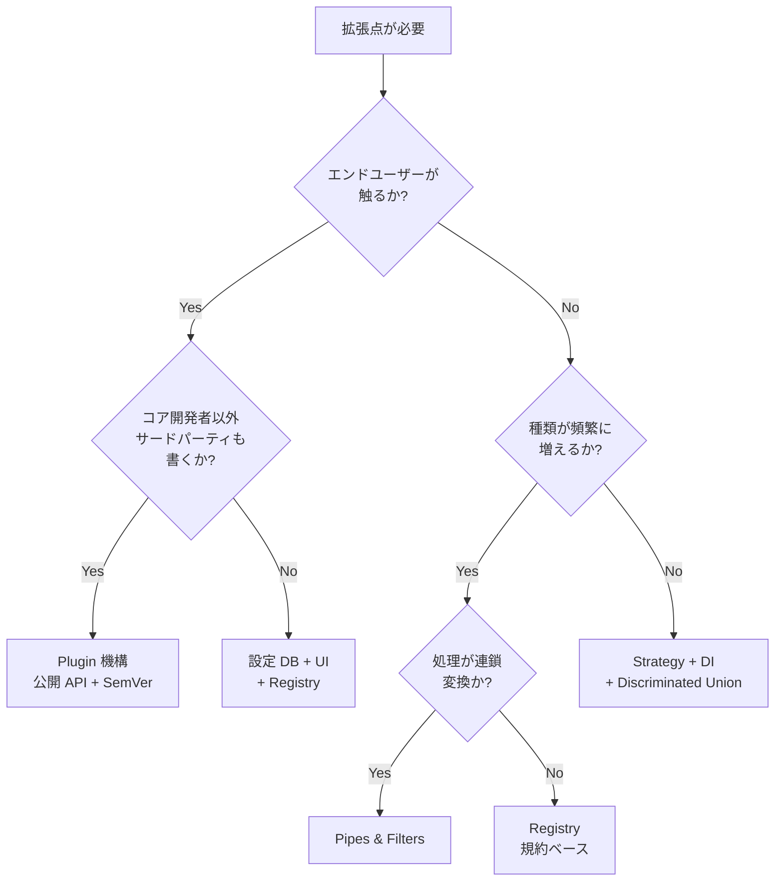

# TL;DR

# はじめに

こんにちは、Dress Code でプロダクトエンジニアをしている [ないとー](https://x.com/_bwkw_) です！

私たちは [DRESS CODE](https://www.dress-code.com/ja) という、グローバル向けの Workforce Management プロダクトを開発しています。

プロダクトを育てていると、機能追加や外部連携、運用の変化に合わせて、どこを差し替えポイントとして公開するか、どこまで外から触れる境界を広げるか、といった判断を何度も迫られます。これは OSS のメンテナに限った話ではなく、自社プロダクトを育て続けるうえでも避けて通れないテーマです。公開した拡張点が増えるほど保守や後方互換の負担も積み上がり、一度入れた仕組みを後から畳むのも容易ではありません。

このあたりを一度自分なりに整理しておきたかった、というのがこの記事の動機です。

設計の文脈で「拡張性」というと、つい Plugin 機構の話に直行しがちですが、Strategy、Registry、パイプライン、イベント、Decorator、型で拡張点を閉じるアプローチまで、向き不向きは手段ごとにかなり違います。呼び方は文献ごとに揺れるので、まず「何を追加・差し替えしたいか」で束ねてから代表例を順に紹介します。

同じように拡張点の切り方で迷っている方の参考になれば幸いです👋

# 拡張点の見取り図

文献の呼び方は違っても、拡張の切り口はだいたい次の表のどれかに寄ります。

| グループ | パターン名 | 一行で言うと |
| --- | --- | --- |
| [実装ごと差し替える](#%E5%AE%9F%E8%A3%85%E3%81%94%E3%81%A8%E5%B7%AE%E3%81%97%E6%9B%BF%E3%81%88%E3%82%8B) | [Strategy](#strategy) | 処理全体を別実装に差し替える |
| | [Template Method](#template-method-%E3%81%A8%E3%83%95%E3%83%83%E3%82%AF) | 共通フローの一部ステップだけ差し替える |
| | [Decorator](#decorator) | 既存処理の外側に責務を重ねる |
| [種別ごとに振る舞いを増やす](#%E7%A8%AE%E5%88%A5%E3%81%94%E3%81%A8%E3%81%AB%E6%8C%AF%E3%82%8B%E8%88%9E%E3%81%84%E3%82%92%E5%A2%97%E3%82%84%E3%81%99) | [Registry](#registry) | キーから実装を引いて呼び出す |
| | [Observer](#observer%E3%82%A4%E3%83%99%E3%83%B3%E3%83%88pub-sub) | 状態変化を購読者へ通知する |
| [段でつないで処理する](#%E6%AE%B5%E3%81%A7%E3%81%A4%E3%81%AA%E3%81%84%E3%81%A7%E5%87%A6%E7%90%86%E3%81%99%E3%82%8B) | [Pipes & Filters](#pipes--filters) | データを段階的に変換する |
| | [Chain of Responsibility](#chain-of-responsibility) | ハンドラを鎖でつなぎ順に渡す |
| [外部モジュールを差し込む](#%E5%A4%96%E9%83%A8%E3%83%A2%E3%82%B8%E3%83%A5%E3%83%BC%E3%83%AB%E3%82%92%E5%B7%AE%E3%81%97%E8%BE%BC%E3%82%80) | [Plugin](#plugin-%E3%81%A8-spi) | 外部の実装を動的に差し込む |
| | [Microkernel](#microkernel) | 最小コアの周囲に拡張モジュールを配置する |
| [型と生成で閉じる](#%E5%9E%8B%E3%81%A8%E7%94%9F%E6%88%90%E3%81%A7%E9%96%89%E3%81%98%E3%82%8B) | [discriminated union](#discriminated-union-%E3%81%A8-exhaustiveness-checking) | 種類追加をコンパイラに検知させる |
| | [DSL](#dslrules-engine%E8%A8%AD%E5%AE%9A%E9%A7%86%E5%8B%95) | コードの外側のルールで切り替える |
| | [Factory Method](#factory-method-%E3%81%A8-abstract-factory) | 生成する実装を選び替える |
| | [Visitor](#visitor) | 構造を変えずに操作を追加する |
| | [Bridge](#bridge) | 抽象軸と実装軸を独立に増やす |

# 実装ごと差し替える

## Strategy

[Strategy](https://en.wikipedia.org/wiki/Strategy_pattern) は、ひとつの役割をインターフェースで定義し、実装を複数用意して DI や設定で差し替えるやり方です。

```typescript
interface PaymentGateway {
  charge(amount: number, currency: string): Promise<ChargeResult>;
}

class StripeGateway implements PaymentGateway {
  /* ... */
}
class PaypalGateway implements PaymentGateway {
  /* ... */
}

class CheckoutService {
  constructor(private gateway: PaymentGateway) {}
}
```

実装の種類がそう増えず、公開インターフェースが長く安定している場面で効きやすいです。差し替えはコンパイル時や DI コンテナ、環境変数などで決めることが多いです。

一方、インターフェースは「最大公約数」になりがちで、ある実装だけの固有機能を出したくなると無理が出ます。ダミー実装や無意味な分岐が増えてきたら、「種別ごとに振る舞いを増やす」Registry や「型と生成で閉じる」型・ルール・設定へ逃がす方向を検討してもよいです。

## Template Method とフック

[Template Method](https://en.wikipedia.org/wiki/Template_method_pattern) は、アルゴリズムの骨格（処理の流れ）を親やフレームワークが持ち、特定のステップだけサブクラスやコールバックで差し替えます。Strategy が「処理全体をオブジェクトに委譲」するのに対し、こちらは「流れは共通で、埋める場所だけ開ける」形です。ここでいう Hook は、`beforeXxx` のように単一のライフサイクルや処理手順の途中に差し込む点を指します。一方、複数の購読者へ状態変化を広める [Observer](https://en.wikipedia.org/wiki/Observer_pattern) やドメインイベントとは別物です。後者は拡張面が「イベント」になり、次の節「種別ごとに振る舞いを増やす」とセットで語られることが多いです。テンプレを提供する側と、ステップを実装する側に役割が分かれるのが典型で、拡張のタイミングはコンパイル時やフレームワークの登録時になります。

落とし穴は、親クラスや基底モジュールが肥大化し、継承だけが増えて変更が連鎖することです。ある時点でコンポジションへ寄せたり、一部を Strategy に切り出したりするかどうかを先に決めておくと後が楽です。

```typescript
abstract class ReportJob {
  async run(): Promise<void> {
    const raw = await this.fetch();
    const out = this.transform(raw);
    await this.save(out);
  }
  protected abstract fetch(): Promise<unknown>;
  protected transform(data: unknown): unknown {
    return data;
  }
  protected abstract save(out: unknown): Promise<void>;
}

class DailySalesReport extends ReportJob {
  protected async fetch() {
    /* DB から取得 */
  }
  protected async save(out: unknown) {
    /* S3 に保存 */
  }
}
```

処理の骨格は共通のまま、一部ステップだけ顧客やレポート種別ごとに変えたいときに向きます。フレームワークがライフサイクルやジョブの `before` / `after` を公開するときも典型です。差し替えが一ステップだけなら継承より Strategy やコールバックのほうが軽いことがあり、基底クラスが深くなる見込みがあるときも見送りがちです。

## Decorator

[Decorator](https://en.wikipedia.org/wiki/Decorator_pattern) は、既存のコンポーネントをラップして振る舞いを「差し替える」より外側から足します。認証、ログ、キャッシュ、計測、レート制限など横断的関心事を増やすときの拡張点として現れやすいです。Express や Koa のミドルウェアのように「関数を包んで連鎖する」書き方はこの一族です。認証・ログ・キャッシュのように、本体の契約を変えずに横から責務を足したい関数やクラスの境界でよく使われます。包み方と「順に渡して途中で止める」動きの見分けは、この節の末尾の表と「段でつないで処理する」で整理します。

```typescript
type Handler = (req: Request) => Response;

function withLogging(inner: Handler): Handler {
  return (req) => {
    console.log(req.url);
    return inner(req);
  };
}
```

ラッパーが深くなるとデバッグやスタックトレースが読みにくくなるので、公開する関数の形とログの粒度を最初から決めておくとよいです。

Strategy だけに比べて横軸が増えると迷いやすいので、Decorator・Chain of Responsibility・Observer を Strategy と並べて最小限だけ整理します。

| 観点 | Strategy | Decorator（ミドルウェア含む） | Chain of Responsibility | Observer / イベント |
| --- | --- | --- | --- | --- |
| いじる対象 | 処理全体の実装を差し替える | 既存処理の外側に責務を足す（ラップ） | 処理者の鎖・順序・途中で止めるか | 状態変化へ複数の購読者を足す |
| 増えるもの | 別実装クラス | ラッパやミドルウェア関数 | ハンドラの段と順序 | リスナ・ハンドラ |

# 種別ごとに振る舞いを増やす

## Registry

種類と実装の対応を動的に引けるようにするのが Registry です。Martin Fowler の [_Patterns of Enterprise Application Architecture_](https://martinfowler.com/eaaCatalog/registry.html) にも同名があり、実務でもそのまま Registry と呼ばれることが多いです。Strategy が「同一インターフェースの複数実装」であるのに対し、Registry はキーや規約で実装を増やしても、ディスパッチ側の固定コードをあまり増やさずに済ませたいときのイメージです。イベント種別やコマンド名、プラグイン ID のように種別が後から増え続ける一方で、`dispatch` に `if` を増やしたくないときに向きます。拡張するのはコア開発者に限らず、チーム内の別モジュールまで広げやすく、登録はコンパイル時や起動時、場所はモジュール境界や規約ベースのファイル配置になりがちです。

```typescript
type Handler<T> = (input: T) => Promise<void>;

const handlers = new Map<string, Handler<unknown>>();

export function register<T>(eventType: string, handler: Handler<T>) {
  handlers.set(eventType, handler as Handler<unknown>);
}

export async function dispatch(eventType: string, payload: unknown) {
  const handler = handlers.get(eventType);
  if (!handler) throw new Error(`No handler for ${eventType}`);
  await handler(payload);
}
```

キーが素の文字列だとリネーム漏れが silent failure になりやすいので、`as const` と判別可能なユニオンで型を効かせることが多いです。また `register` が走る前に `dispatch` が呼ばれると落ちるので、モジュール初期化順や lazy registration の方針を決めておく必要があります。

esbuild の [plugin API](https://esbuild.github.io/plugins/) はこの構造に近く、`onResolve` と `onLoad` でパターンと処理のペアを登録し、ビルド時にマッチしたものが呼ばれます。仮想モジュールを一つ差し込むだけの短い例が次です。

```typescript
import type { Plugin } from "esbuild";

export const virtualEnvPlugin: Plugin = {
  name: "virtual-env",
  setup(build) {
    build.onResolve({ filter: /^virtual:env$/ }, () => ({
      path: "virtual:env",
      namespace: "virtual-env",
    }));
    build.onLoad({ filter: /.*/, namespace: "virtual-env" }, () => ({
      contents: `export const MODE = "production"`,
      loader: "js",
    }));
  },
};

// build({ ..., plugins: [virtualEnvPlugin] })
```

## Observer、イベント、pub-sub

[Observer](https://en.wikipedia.org/wiki/Observer_pattern) やイベントバスは、拡張点がメソッド呼び出しではなく「イベント」として表に出るのが特徴です。GUI、ドメインイベント、フレームワークの pub-sub と相性がよく、イベント種別ごとに上のような `register` を並べると Registry とセットで語られることが多いです。ひとつの状態変化に対して、監査ログやメール通知、キャッシュ無効化など、独立した購読者を後から足していきたいときに向きます。通知順に依存すると壊れやすいので、同期か非同期か、エラー時に後続を止めるかをチームで決めておくと運用が楽です。

連携ではメッセージの内容やヘッダで送り先を変える仕組みもよく出ますが、その読み方は見取り図のとおり、EIP では独立パターンとして名が付いていても、自分のコード側では Registry とパイプライン相当へ落とし込むと単純になりやすいです。

# 段でつないで処理する

## Pipes & Filters

[Pipes & Filters](https://en.wikipedia.org/wiki/Pipe_and_filter_architecture)（POSA Vol.1 の *Pattern-Oriented Software Architecture* にも載る）と [Microsoft の cloud design pattern「Pipes and Filters」](https://learn.microsoft.com/en-us/azure/architecture/patterns/pipes-and-filters) は、処理を小さな変換器の連鎖として表現するパターンです。各 filter は単一責務で、順序を入れ替えたり間に挟んだりしやすいです。PostCSS が CSS の AST を順に通す思路、unified（remark / rehype）が Markdown から HTML へ至る AST の連鎖、Babel のプラグイン列など、フロントエンドのツールチェーンではそのまま顔を出します。

```typescript
type Filter<T> = (input: T) => T | Promise<T>;

async function pipe<T>(input: T, filters: Filter<T>[]): Promise<T> {
  let acc = input;
  for (const filter of filters) {
    acc = await filter(acc);
  }
  return acc;
}
```

filter 間でデータ形状が暗黙に変わると順番依存が急に強くなるので、段階ごとに型でゲートを書くと安全です。全 filter が大きな AST を抱えるとメモリと計算量もチェーン長に比例するので、パイプラインの長さそのものも設計対象になります。入力から出力へ線形に流れ、各段が単一責務で、順序の入れ替えや段の挿入が前提になる処理（ビルドチェーン、ETL、Lint のパイプなど）でよく使われます。

## Chain of Responsibility

[Chain of Responsibility](https://en.wikipedia.org/wiki/Chain-of-responsibility_pattern) は、複数ハンドラを鎖状につなぎ、順に渡して誰が処理するかを決めます。バリデーション、認可、コマンドのディスパッチなどで「参加者と順序」を増やす拡張点になりやすいです。パイプがだいたい「各段でデータを変換していく」イメージなら、連鎖はしばしば「どれかが引き取ったらそこで終わる」ことが多く、主題が委譲側にあると捉えると両者の違いがつかみやすいです。Web のミドルウェア列は、「実装ごと差し替える」の末尾の表のとおり「包む Decorator」としても「順に渡す CoR」としても読める典型です。順序への暗黙の依存はドキュメントやテストで固定しておくと安心です。

```typescript
type Next = () => Promise<Response>;
type MW = (req: Request, next: Next) => Promise<Response>;

function compose(final: (req: Request) => Promise<Response>, stack: MW[]) {
  return (req: Request) =>
    stack.reduceRight<Next>(
      (next, mw) => () => mw(req, next),
      () => final(req)
    )();
}
```

認証から認可、レート制限、本体処理へと順番を決めて段を増やしたいときや、実行時にハンドラの並びを差し替えたいときに向きます。[Chain of Responsibility のトレードオフ整理](https://www.systemoverflow.com/learn/behavioral-patterns/chain-of-responsibility/chain-of-responsibility-trade-offs-and-when-to-use) にもあるとおり、常に同じ一つのハンドラしか使わないなら素直に呼び出すだけで足ります。チェーンが極端に長くコストが支配的になる場合や、ハンドラ同士が密に状態を共有する場合は別の形を検討したほうがよいです。

[EIP](https://www.enterpriseintegrationpatterns.com/) では [Message Router](https://www.enterpriseintegrationpatterns.com/patterns/messaging/MessageRouter.html) や Content-Based Router が独立した名前として載りますが、この記事での位置づけは「Pipes & Filters に沿った経路」と「Registry 的な lookup や条件分岐」を組み合わせた派生として読むことにします。連携の世界では Content Enricher のような名前も多くの場合 [Pipes & Filters](https://en.wikipedia.org/wiki/Pipe_and_filter_architecture) の具体パターンとして説明できます。動的ルータも単独の魔法のコンポーネントというより、パイプ途中の分岐とキーでの引き当ての組み合わせとして捉えると整理しやすいです。

# 外部モジュールを差し込む

## Plugin と SPI

サードパーティがコードを独立して配布し、ホストが動的に取り込むのがいわゆる Plugin です。Registry、動的読み込み、公開 API の組み合わせで実現し、Java の [`ServiceLoader`](https://docs.oracle.com/en/java/javase/21/docs/api/java.base/java/util/ServiceLoader.html)（SPI）や [Oracle の SPI チュートリアル](https://docs.oracle.com/javase/tutorial/ext/basics/spi.html) で説明される読み込み方も同じ棚に並びます。拡張する主体は OSS の contributor や利用者にまで広がり、境界は公開されたプラグイン API になります。

ESLint の `eslint-plugin-*`、Prettier の `prettier-plugin-*`、VS Code の拡張のように、ホストが安定した差し込み口を用意し、そこに載せる形が典型です。Plugin は「拡張を配布・読み込みする仕組み」寄りの語です。

```typescript
export interface HostApi {
  registerCommand(name: string, run: () => void): void;
}

export interface Plugin {
  name: string;
  setup(host: HostApi): void;
}

const plugins: Plugin[] = [];

export function registerPlugin(p: Plugin) {
  plugins.push(p);
}

// 例: const mod = await import(`./extensions/${name}.js`); registerPlugin(mod.default);
```

IDE や Linter、CMS、CI、マーケットプレイス型 SaaS のように、利用者やサードパーティが拡張を持ち寄るプロダクトで効きます（[Plugin Architecture の整理例](https://quality.arc42.org/approaches/plugin-architecture)）。機能が最初からほぼ決まっていて、公開 API を長く守るコストに見合わない社内向けツールでは見送りがちです。

## Microkernel

[Microkernel](https://www.oreilly.com/library/view/software-architecture-patterns/9781098134280/ch04.html) は、最小のコアと内部・外部の拡張モジュールでシステム全体を組み立てるアーキテクチャの話です。誰がどの境界まで公式に触れるか、デプロイ単位やプロセス境界まで含めて決めるイメージが強く、Plugin をひとつの技法としてその上に載せることがあります。Plugin が機構・Microkernel が全体構成のパターン、という上下関係だと捉えると誤解が減ります。

```typescript
/** コアは最小限。あとはプラグインが業務を足すイメージ */
class CoreSystem {
  private extensions = new Map<string, { boot(): Promise<void> }>();

  register(id: string, ext: { boot(): Promise<void> }) {
    this.extensions.set(id, ext);
  }

  async startAll() {
    for (const ext of this.extensions.values()) await ext.boot();
  }
}
```

製品として配布するアプリや、顧客や地域ごとに有効機能が変わる業務システム（名前の由来どおり IDE や OS にも近い発想）で採用されることがあります。単一テナント・単一プロダクトで、拡張境界まで設計するコストが割に合わないときは、Plugin より Strategy や Registry で足りることが多いです。

Plugin 機構は一度公開した API を長く守る前提があります。[Hyrum's Law](https://www.hyrumslaw.com/) のように、ドキュメントに書いていない振る舞いも依存として固定されやすく、内部リファクタを難しくします。バージョン方針は [Semantic Versioning](https://semver.org/lang/ja/) とセットで決めることが多く、SDK やサンプル、移行ガイドまで含めてコストがかかります。業務 SaaS の社内ツールで「将来 Plugin」と言い始めたら一度止まり、チーム内で Strategy や Registry で足りないか確認したほうが無難なことが多いです。

# 型と生成で閉じる

実行時のプラグインではなく、型・ルール・生成で拡張を閉じる話です。

## discriminated union と exhaustiveness checking

Open-Closed（追加に開き変更に閉じる）は [Bertrand Meyer](https://bertrandmeyer.com/wp-content/upLoads/OOSC2.pdf) が定式化した原則で、ここでは TypeScript で「種類を増やしたときにコンパイルが教えてくれる」話に絞ります。[discriminated union と exhaustiveness checking](https://www.typescriptlang.org/docs/handbook/2/narrowing.html)（判別可能なユニオンと網羅性チェック）を組み合わせると、分岐の漏れを実行時まで待たずに拾えます。

```typescript
type PaymentEvent =
  | { kind: "charged"; amount: number }
  | { kind: "refunded"; amount: number; reason: string }
  | { kind: "disputed"; caseId: string };

function handle(event: PaymentEvent): string {
  switch (event.kind) {
    case "charged":
      return `charged ${event.amount}`;
    case "refunded":
      return `refunded ${event.amount}: ${event.reason}`;
    case "disputed":
      return `disputed: ${event.caseId}`;
    default:
      const _exhaustive: never = event;
      return _exhaustive;
  }
}
```

業務系の Web アプリでは、手数が少ないのに効くのがこのパターンになりやすいです。「まず設定 DB に」と言う前に、ドメインの種類を型で表現できないかを検討する価値があります。種類がアプリケーションと一緒にデプロイでき、実行時にユーザーが勝手に型を増やさないドメインなら第一候補になりやすいです。プラグインで型が増え続けるなら、設定や DSL より先に境界設計を見直したほうが安全です。

## DSL、rules engine、設定駆動

Strategy や Registry の実装クラスが増えすぎた先では、ルールエンジン・DSL・ワークフロー定義・設定ファイルによる切り替えへ逃がす選択があります。思想の入口として [Internal Reprogrammability](https://martinfowler.com/bliki/InternalReprogrammability.html) が役に立ちます。ルールエンジンと Read-only DSL については [Rules Engine](https://martinfowler.com/bliki/RulesEngine.html) や [DSL ガイド](https://martinfowler.com/dsl.html) にも注意点がまとまっています。

```typescript
type Ctx = { tenureMonths: number; region: string };

function rule() {
  return {
    when: (pred: (c: Ctx) => boolean) => ({
      then: (days: number) => ({ test: pred, grantDays: days }),
    }),
  };
}

const vacationRules = [
  rule().when((c) => c.tenureMonths >= 12).then(15),
  rule().when((c) => c.region === "EU").then(5),
];
```

Strategy や Registry の分岐が増え、ルールの見え方をレビュアや業務側の読み手向けに整えたいときに検討の価値があります。Fowler が述べるように、非エンジニアが書けることを期待してルールエンジンだけを入れると失敗しやすく、読みやすさやレビューしやすさを目的にしたほうが現実的です。暗黙のルール連鎖だけが肥大化して誰も流れを追えない構成は避けたいところです。

## Factory Method と Abstract Factory

生成まわりでは [Factory Method](https://en.wikipedia.org/wiki/Factory_method_pattern) や [Abstract Factory](https://en.wikipedia.org/wiki/Abstract_factory_pattern) が「どの実装を生成するか」の拡張点になります。

```typescript
interface PaymentGateway {
  charge(n: number): Promise<void>;
}
class StripeGateway implements PaymentGateway {
  async charge() {}
}
class FakeGateway implements PaymentGateway {
  async charge() {}
}

function createGateway(env: "prod" | "test"): PaymentGateway {
  return env === "prod" ? new StripeGateway() : new FakeGateway();
}
```

DI コンテナを置いていないコードベースで、生成の分岐を一か所にまとめたいときや、コンポジションの入口で Strategy の候補を決めたいときに使います。関連製品のファミリをまとめて選ぶなら Abstract Factory のほうが向くことがあります。

## Visitor

判別ユニオンとセットで語られることが多いのが [Visitor](https://en.wikipedia.org/wiki/Visitor_pattern) で、オブジェクト構造を変えずに操作だけを追加したいときの古典的な手段です。関数と switch で網羅性を取るスタイルと目的が近いので、チームの好みで選ぶ場面もあります。

```typescript
type Expr =
  | { tag: "lit"; value: number }
  | { tag: "add"; left: Expr; right: Expr };

function evalExpr(e: Expr): number {
  switch (e.tag) {
    case "lit":
      return e.value;
    case "add":
      return evalExpr(e.left) + evalExpr(e.right);
  }
}

function printExpr(e: Expr): string {
  switch (e.tag) {
    case "lit":
      return String(e.value);
    case "add":
      return `(${printExpr(e.left)}+${printExpr(e.right)})`;
  }
}
```

木や AST のようにタグの集合が比較的安定していて、評価・印刷・最適化など操作だけが増え続けるときに向きます。判別ユニオンを複数の関数に分けるのは、いわゆるモダンな Visitor の形です。タグの種類そのものが頻繁に増えるドメインでは、型を足すたびに全操作を直すことになるので注意が必要です。

## Bridge

抽象と実装の二軸を独立に伸ばしたいときは [Bridge](https://en.wikipedia.org/wiki/Bridge_pattern) が参照になります。この記事の主題である「拡張点の切り口」の中心からは少し外れるので、必要になったタイミングで調べれば十分です。

```typescript
interface Transport {
  deliver(body: string): Promise<void>;
}
class SmtpTransport implements Transport {
  async deliver(body: string) {
    /* メール送信 */
  }
}
class FcmTransport implements Transport {
  async deliver(body: string) {
    /* プッシュ通知 */
  }
}

abstract class Notification {
  constructor(protected transport: Transport) {}
}

class Alert extends Notification {
  async send(text: string) {
    await this.transport.deliver(text);
  }
}
```

通知チャネルや描画バックエンドのように、「何を届けるか」と「どう届けるか」の両方に増え方の見通しがあるとき、`M × N` の継承や巨大な `if` を避けられます。どちらか一方の軸しか増えないなら、単純な Strategy や単一インターフェースで足りることが多いです。

いずれも「差し替え」という語に寄せて読むと混線しやすいので、軸がひとつかふたつか、あるいは生成か操作追加かを先に言語化すると整理しやすいです。

# 素朴な選択の指針

設計レビューで「結局どれ？」となりがちなので、あくまで素朴な入口だけ置いておきます。万能のフローチャートではありません。

次の図は「まず大雑把にどこを見るか」のための簡略化です。Template Method、Decorator、Observer、Chain of Responsibility は枝に出していませんが、見取り図の表と「実装ごと差し替える」の末尾の比較表で「何を増やしたいか」に当てはめれば拾えます。



# まとめ

文献ごとに名前が増えるので、まず「何を追加・差し替えしたいか」で束ねると迷子になりにくいです。見取り図のグループどおりに言えば、実装ごと差し替えるなら Strategy と Template Method と Decorator、種別ごとに振る舞いを増やすなら Registry とイベント、段でつないで処理するならパイプと Chain of Responsibility、外部モジュールを差し込むなら Plugin と Microkernel、型と生成で閉じるなら discriminated union や DSL、という順で頭に置くと実務では扱いやすいです。

TypeScript であれば判別可能なユニオンと網羅性チェックで Open-Closed に寄せるのが、手数に対して効きやすいことが多いです。Plugin は公開境界の維持コストを覚悟できるときの選択肢で、先に書いたとおり Microkernel 全体像の一部として選ぶこともあります。

拡張点を用意しても、想定と違う方向から要件が来ることは珍しくありません。一度足した境界を畳むのは簡単ではないので、迷ったら見取り図を一枚メモにしてから決めるとよいです。段階的な置き換えは [Strangler Fig Application](https://martinfowler.com/bliki/StranglerFigApplication.html) のような話として別途参照するとよいです。

銀の弾丸ではありませんが、設計の場面で名前に振り回されたときに「何を可変にしたいかへ戻れる」足場になればうれしいです👋
